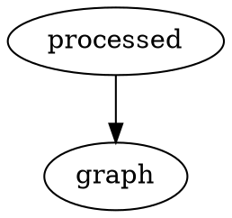

# How to Document

<!-- toc -->

## How to add inline citations
1. edit [src/bibliography.bib](https://github.com/UBC-iGEM/internal-wiki-2023-24/blob/main/src/bibliography.bib), check [here](https://bibtex.eu/types/) for the fields to fill out.
2. Then call your reference like this: [@ref_name]

Check out [an example](https://github.com/jacob-pro/mdbook-bibfile-referencing/tree/master/test-book).

## How to write Markdown

Check out the [CommonMark quick reference](https://commonmark.org/help/) first. Much of this document is borrowed from the rustdoc book[^rust].

Here are some features you must use in our internal wiki:

1. Adding References. See [above](how.md#how-to-add-inline-citations)

2. Adding Tables. To make cooler tables, check out the [GitHub Tables extension](https://github.github.com/gfm/#tables-extension-).

| Header1 | Header2 |
| ------- | ------- |
| abc     | def     |

```
| Header1 | Header2 |
|---------|---------|
| abc     | def     |

```

3. Adding task lists.

```
- [x] Complete task
- [ ] Incomplete task
```

4. Warning blocks

<div class="warning">A big warning!</div>

```
<div class="warning">A big warning!</div>
```

5. Latex, via [MathJax](https://www.mathjax.org/)

```
\\[ \mu = \frac{1}{N} \sum_{i=0} x_i \\]
```

\\[ \mu = \frac{1}{N} \sum_{i=0} x_i \\]

6. Graphs via the [DOT Language](https://graphviz.gitlab.io/doc/info/lang.html)



7. [Including Files](https://rust-lang.github.io/mdBook/format/mdbook.html#including-files)

Note you can write HTML in Markdown as well! But please refrain from doing so unless necessary.

If you want to see all the Markdown features available to you, here is the [spec](https://spec.commonmark.org/0.30/).

## How to add new pages and subsections

Run `mdbook serve`, then follow the instructions [here](https://rust-lang.github.io/mdBook/format/summary.html) on how to add new pages and subsections. When are you creating new pages, please follow these file naming conventions. Any files that don't conform to these file naming conventions will not be accepted as documentation.

1. Only punctuation that is allowed are dashes.
2. All lowercase.
3. When possible create folders to categorize files. If you need help with this, send a message in the documentation/wiki channel.
4. Only .md files are allowed.
5. Numbers are allowed.

[^rust]: https://doc.rust-lang.org/rustdoc/how-to-write-documentation.html
