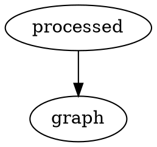

# How to Document

<!-- toc -->

## How to use the internal wiki with Replit

### How to run the internal wiki on Replit

<iframe src="https://scribehow.com/embed/Accessing_and_Editing_UBC-iGEM_Wiki_Page__28CL9QzYTb6sJZu4gRdm9w" width="100%" height="640" allowfullscreen frameborder="0"></iframe>

### How to push changes to internal wiki on Replit

<iframe src="https://scribehow.com/embed/Push_changes_to_Internal_Wiki_on_Replit_Step-by-Step_Guide__jItfj2-jSwCz9w1tIQNLTA" width="100%" height="640" allowfullscreen frameborder="0"></iframe>

## How to use the internal wiki with Codespaces

1. If you haven't already opened a Codespace, open a new Codespace and **do not** hit anything while the Codespace starts up.
2. Once the Codespace is done downloading all the packages required, run `mdbook serve` to start up a local version of the internal wiki.
3. Now follow the instructions for [adding changes to GitHub](#adding-changes-to-github)

## Adding changes to GitHub

1. Open up the internal wiki on Codespaces or your local development environment.
2. Before you add any changes, run `git pull`. This ensures that your local version of the internal wiki is updated with other people's changes. If you don't do this step you make end up with merge conflicts. If running `git pull` results in merge conflicts (it shouldn't if you're always running `git pull`), let Lucy or a wiki liaison know.
3. Make a new branch `git branch [name-subteam-description]`. Then switch to that branch, `git checkout [name-subteam-description]`. Someone would run:

```git
git branch lucy-drylab-software
git checkout lucy-drylab-software
```

4. Now you can write your updates in!
5. When you are ready to publish your updates, you will need to save your files. In git, this is called making a commit. Git provides finer grain control, meaning you can choose which files to save in a project; most of the time you want to save all the files you have modified. Run `git add .`. This adds all modified and created files to the staging area.
6. Once you are satisfied with the files in the staging area, run `git commit -m "[message]"`. Replace `[message]` with a meaningful message related to your changes.
7. Finally, you can run `git push`. Make sure you are pushing to the UBC iGEM repo, if asked where to push, push to the repo with the link [https://github.com/UBC-iGEM/internal-wiki-2023-24]; you can push to your own fork, but please enable this [setting](https://docs.github.com/en/pull-requests/collaborating-with-pull-requests/working-with-forks/allowing-changes-to-a-pull-request-branch-created-from-a-fork).
8. Following the prompts on Codespaces or the GitHub website, make a PR. That's it! Leads and wiki liaisons will check your content and approve and merge your PR.

## How to use mdBook locally

mdBook is an open source project developed by the Rust Foundation for documenting Rust packages. If you're running Windows, I recommend you get WSL. You can get started [here](https://rust-lang.github.io/mdBook/guide/installation.html). Let Lucy know if you have any issues.

## How to add inline citations
1. edit [src/bibliography.bib](https://github.com/UBC-iGEM/internal-wiki-2023-24/blob/main/src/bibliography.bib), following the format.
2. Then call your reference like this: [@clines1974evidence, 22]

Check out [an example](https://github.com/jacob-pro/mdbook-bibfile-referencing/tree/master/test-book).

## How to write Markdown

Check out the [CommonMark quick reference](https://commonmark.org/help/) first. Much of this document is borrowed from the rustdoc book[^rust].

Here are some features you must use in our internal wiki:

1. Adding References. If a reference is added in another format, the member who added the reference must convert it to this format.

```
This is an example of a footnote[^note].

[^note]: This text is the contents of the footnote. Make sure to put this at the bottom of your document.
```

2. Adding Tables. To make cooler tables, check out the [GitHub Tables extension](https://github.github.com/gfm/#tables-extension-).

| Header1 | Header2 |
| ------- | ------- |
| abc     | def     |

```
| Header1 | Header2 |
|---------|---------|
| abc     | def     |

```

3. Adding task lists.

```
- [x] Complete task
- [ ] Incomplete task
```

4. Warning blocks

<div class="warning">A big warning!</div>

```
<div class="warning">A big warning!</div>
```

5. Latex, via [MathJax](https://www.mathjax.org/)

```
\\[ \mu = \frac{1}{N} \sum_{i=0} x_i \\]
```

\\[ \mu = \frac{1}{N} \sum_{i=0} x_i \\]

6. Graphs via the [DOT Language](https://graphviz.gitlab.io/doc/info/lang.html)



7. [Including Files](https://rust-lang.github.io/mdBook/format/mdbook.html#including-files)

Note you can write HTML in Markdown as well! But please refrain from doing so unless necessary.

If you want to see all the Markdown features available to you, here is the [spec](https://spec.commonmark.org/0.30/).

## How to add new pages and subsections

Run `mdbook serve`, then follow the instructions [here](https://rust-lang.github.io/mdBook/format/summary.html) on how to add new pages and subsections. When are you creating new pages, please follow these file naming conventions. Any files that don't conform to these file naming conventions will not be accepted as documentation.

1. Only punctuation that is allowed are dashes.
2. All lowercase.
3. When possible create folders to categorize files. If you need help with this, send a message in the documentation/wiki channel.
4. Only .md files are allowed.
5. Numbers are allowed.

Now go to the following pages to see how to write documentation if you are a:

- Member: Go to your subteam and read over every subsection.
- [Lead](./lead.md)
- [Wiki Liaison](./liaison.md)

[^rust]: https://doc.rust-lang.org/rustdoc/how-to-write-documentation.html
