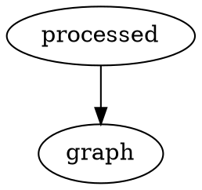

# How to Document 

## How to write Markdown

Check out the [CommonMark quick reference](https://commonmark.org/help/) first. Much of this document is borrowed from the rustdoc book[^rust].

Here are some features you must use in our internal wiki:
1. Adding References. If a reference is added in another format, the member who added the reference must convert it to this format.

```
This is an example of a footnote[^note].

[^note]: This text is the contents of the footnote. Make sure to put this at the bottom of your document.
```

2. Adding Tables. To make cooler tables, check out the [GitHub Tables extension](https://github.github.com/gfm/#tables-extension-).

| Header1 | Header2 |
|---------|---------|
| abc     | def     |

```
| Header1 | Header2 |
|---------|---------|
| abc     | def     |

```

3. Adding task lists.

```
- [x] Complete task
- [ ] Incomplete task
```

4. Warning blocks

<div class="warning">A big warning!</div>

```
<div class="warning">A big warning!</div>
```

5. Latex, via [MathJax](https://www.mathjax.org/)
```
\\[ \mu = \frac{1}{N} \sum_{i=0} x_i \\]
```

\\[ \mu = \frac{1}{N} \sum_{i=0} x_i \\]


6. Graphs via the [DOT Language](https://graphviz.gitlab.io/doc/info/lang.html)



Note you can write HTML in Markdown as well! But please refrain from doing so unless necessary.

If you want to see all the Markdown features available to you, here is the [spec](https://spec.commonmark.org/0.30/).

## How to add new pages and subsections
Open this 

Now go to the following pages to see how to write documentation if you are a:
- [Member](./documentation/member.md)
- [Lead](./documentation/lead.md)
- [Wiki Liaison](./documentation/liaison.md)

[^rust]: https://doc.rust-lang.org/rustdoc/how-to-write-documentation.html