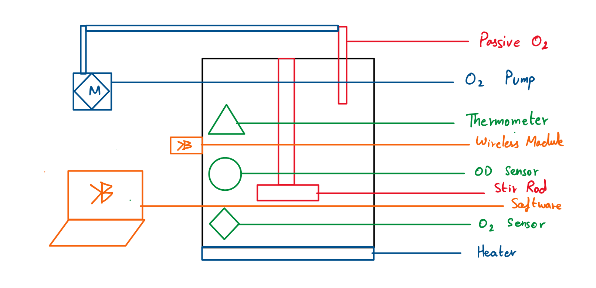

# Bioreactor

<!-- toc -->

## Overview

A bioreactor is a device that provides a controlled environment for the cultivation of biological organisms (like bacteria, yeast, plant and animal cells) under specific conditions to promote growth. Controllable conditions include temperature, pH, oxygen levels, and nutrient supply, which are precisely manipulated to optimize the resident population’s biological processes [@bioprocess].

Developing a bioreactor early on in our competitive season significantly enhanced our project’s outcomes, by allowing for scalable production of W.T. E Coli for the numerous experiments that Wet-Lab aimed to complete. Additionally, it served as a training tool for rookie Wet-Lab members learning to culture E Coli., teaching them concepts of cell culture and molecular cloning through an error proof system.

## Goals and non-goals

The motivation behind the Bioreactor was to provide Wet-Lab with a device facilitating rapid E Coli. cultures, allowing for a steady reservoir of host bacteria should there be a need for unplanned experiments. The decision to prioritize the construction of the first iteration of the Bioreactor was based on the team’s experience from the previous year, where leaving it to the end precluded the prototype from testing and implementation in Wet-Lab’s procedures. As such, development of the Bioreactor began in March 2024, and followed the Engineering design cycle through 4 iterations, until the final prototype was completed in mid-July.

## The actual design

The Bioreactor iterated through 4 major design changes (denoted by Marks), with numerous modifications between each iteration (denoted by letters).

### Bioreactor Mk. 1

This version of the bioreactor would have the following features AT MINIMUM:

- Stir Rod
- Passive Oxygen diffuser

The functionality is to just grow W.T. E Coli. somehow, and show it isn’t just in a culture. The stir road provides kinetic stimulation, the oxygen Diffuser maintains O2 levels via diffusion. I don’t expect a lot of iteration within this Mark, maybe 1 or 2 just adding dead spaces/module slots for later additions to the bioreactor. With the passive oxygen diffuser, E. coli can grow in both anaerobic and aerobic conditions so the diffuser is primarily responsible for regulating the pressure levels inside the reactor. If required, active diffusion and O2 readout can be added but are not necessary for efficient function.

### Bioreactor Mk. 2

This version of the bioreactor would have the following features AT MINIMUM:

- Stir Rod
- Active Oxygen Diffuser (Pumps)
- Temperature Control Module

In Mk. 2, we add more variables to control the growth rate of the E Coli., and likely iterate within to optimize growth conditions. This would require significant wet lab experimentation, and we would attempt to reduce the experiment counts by using literature review to start off close to optimal conditions.

### Bioreactor Mk. 3

This version of the bioreactor would have the following features AT MINIMUM:

- Stir Rod
- Active Oxygen Diffuser (Pumps)
- Temperature Control Module
- OD Readout Module
- O2 readout module
- Arduino Thermometer

Having found the optimal growth conditions, Mk.3 incorporates sensors for readouts. We would start with an OD sampler (for bacterial population) and O2 readout module (to verify oxygen saturation in the system) and an Arduino based thermometer that can send readouts digitally to a computer.

### Bioreactor Mk. 4

This version of the bioreactor would have the following features AT MINIMUM:

- Stir Rod
- Active Oxygen Diffuser (Pumps)
- Temperature Control Module
- OD Readout Module
- O2 readout module
- Arduino Thermometer
- Bluetooth Module/WiFi Module

This would just be software updates. Using the same hardware, develop simple code to get real-time readouts while far away from the bioreactor. This would be great for monitoring purposes.

## Diagram

Generic Diagram looks like this:

Red is Mk.1, Blue is Mk.2, Green is Mk.3 and Orange is Mk.4

## How do we test this?

Testing will primarily be based on one metric: bacterial population in the bioreactor during midpoint of log phase growth.

## How long will this take?

- It would be nice to have Mk. 1 completed by end of April
- It would be nice to have Mk. 2 completed by end of June
- It would be nice to have Mk. 3 completed by mid-August
- It would be nice to have Mk. 4 completed by mid-September

---
