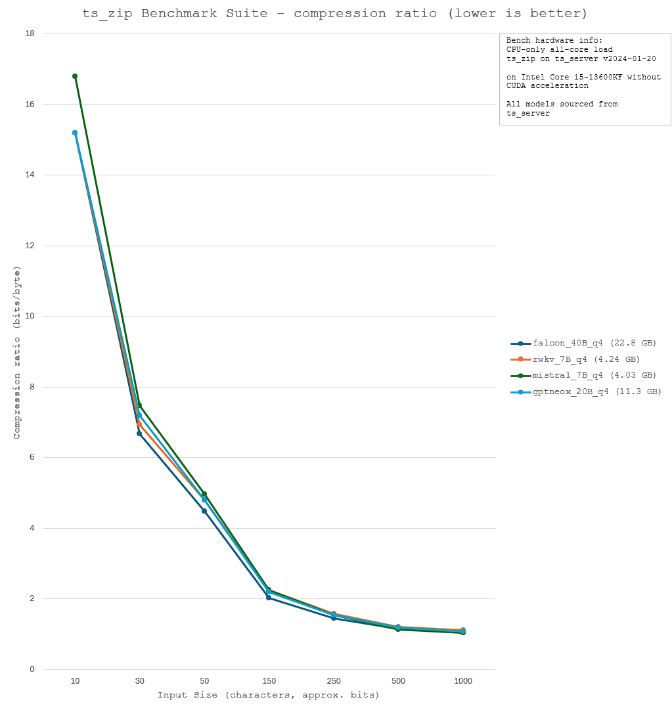
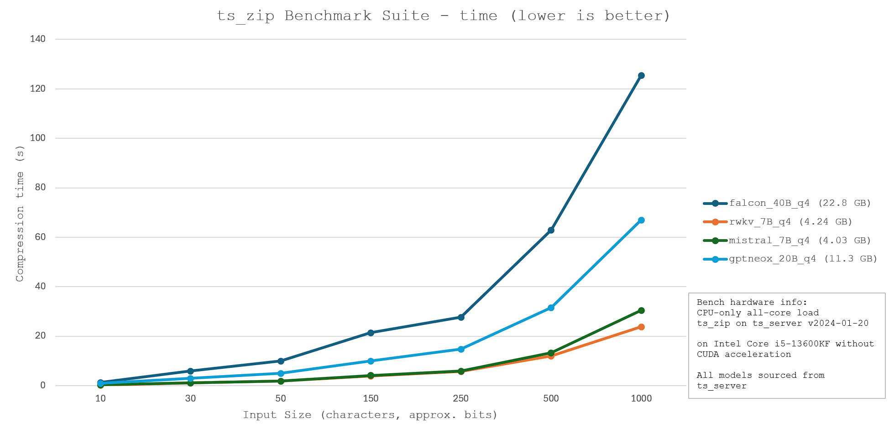

# File compression and decompression

<!-- toc -->

## Primary goal
By encoding a heavily compressed file, we can effectively increase the amount of information stored in DNA for a given number of nucleotide bases.

## Key points
1. Data compression: defined in information theory as the process of encoding information using fewer bits than the original representation. In the context of our work, decreasing the number of nucleotide bases required to encode a given file.
2. Token (LLMs): the fundamental data unit within natural language processing systems such as large language models (LLMs). Most common AI systems used today are some form of LLM (e.g., ChatGPT, Google Gemini, Diffusion-based models such as Stable Diffusion). A token essentially acts as a small component of a large data set; when an LLM takes text input, such as a sentence inputted into a chatbot, it breaks the query down into a set of tokens. These tokens are then processed by the model.
3. Lossless compression: a compression process that does not result in any data loss.
4. Lossy compression: a compression process that results in data loss. For instance, when audio is compressed into common file formats such as .mp3, audio quality is sacrificed to decrease file sizes.
5. Compression ratio: the ratio between the file size of the inputted and outputted files. Often expressed in bits per base (bpb, output/input).

## Text compression

### Dictionary compression (traditional)
Dictionary compression is a traditional text compression mechanism where a "dictionary" is constructed with words or phrases that are commonly used. For example, if the phrase "How are you?" is repeated many times throughout a text, we could define "How are you?" = 0110011001110001, a binary sequence with 16 bits. Thus, we can replace every instance of "How are you?" with this 16-bit identifier as opposed to the original text string which is 96 bits long.

However, dictionary compression functions best when a new dictionary is created for every document inputted, and does not always result in a high compression ratio (especially if repeats are not extremely common in the text).

## Tokenization and the ts_zip utility
ts_zip is a small utility that enables text compression through tokenization. An inputted text is broken down into tokens, and the token "values" are saved as a binary file. The binary file can then run through the same process in reverse; each token is converted back to the string that it is related to. As long as the same model is used for compression and decompression, this process is lossless. In fact, the process is relatively similar to dictionary compression, except the LLM model is used as a static dictionary for all input files, and the token values are used as identifiers.

Thus, the model used for compression must be careful selected, with a focus on optimising for model size, compression speed, and compression ratio. A lower compression ratio (greater efficiency) and a shorter compression time is ideal. Thus, four models - falcon_40B, rwkv_7B, mistral_7B, and gptneox_20B - were evaluated for their relative performance. The benchmark results and technical specifications are shown below.

  

