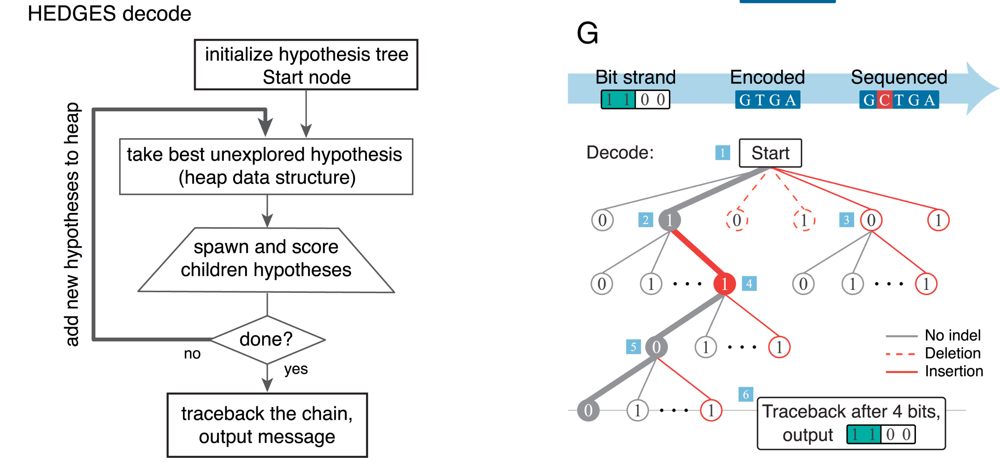

# Error Correction

*Contribtions*: Lucy, Riya

<!-- toc -->

## Overview, Context and Scope
Correcting for errors that occur in the DNA synthesis, storage, sequencing process, as relating to our DNA synthesis method. TdT, and DNA synthesis and sequencing in general have very high rate of error. 

A benchmark for the percentage of errors we may be dealing with:
* % Reads containing errors [@lee_2020_photondirected]:
    * Single base deletions: 25.8%
    * Single base insertions: 13.4%
    * mismatches: 8.9%
    
We must collect enough metadata to correct a DNA sequence with around 30-50% synthesis error [@_2021_teamaachenresults]. We should avoid adding error correction bits unless there is drastic improvement. This could depend on the type of data we are encoding. To complete an iteration of the DBTL cycle, we will implement a simple error correction algorithm for both semi-specific and specific synthesis, followed by testing in silico. Based on the results of the algorithm, we either enhance it or abandon and try another algorithm.

## How does synthesis method affect error correction?
The synthesis method differentiates our sequence recovery method. If we are using semi-specific, we can rely on homonucleotides and number of transitions for sequence consensus. For specific synthesis, we would rely on error correcting codes.

## Semi-specific synthesis 
Given that our synthesis method is semi-specific: this means we can control the **type** of base we are adding, but we cannot control the **number** of bases. Additionally, because we will be attaching “blocks” of bases, such as “AAAA” when we just want “A”, a nucleotide sequence of 100 bases may only contain 20-30 unique nucleotides

The challenge here is how can we apply error correction: 
1. With a limited number of unique nucleotides per strand
2. Where deletion errors are the most likely to occur
3. Where sequences are short (100 nt) 
4. To be robust such than it an tolerate higher rates of error

### What metadata should we collect for semi-specific synthesis?
The number of transitions will be collected, which we can see if it is enough metadata to decode a faulty nucleotide sequence.

### How is error correction done with this metadata?
Using metadata collected during encoding and checksum, systematically guess which base transitions occur. We first find how many base transitions are missing, and try insertions, deletions, mutations to match the recorded metadata. This is similar to solving sudoku, e are guessing which base transitions are correct. We will use stochastic estimation to choose the “most likely” correct bases. Everytime some “constraint” is violated, we can either backtrack or create a new “sudoku” to solve.

We try solving this problem for some allotted time; if the algorithm fails to return we mark the strand as too erroneous to recover and signal failure to the user, otherwise, we move onto to reconstruct the file.

## Specific synthesis: 
Given specific synthesis means we can control the type of base and how many of that base we add. However, gaining the ability to add specifically means deletion errors and insertion errors are more detrimental since there is no redundancy (unless we explicitly add it ourselves). The advantage is that we can choose to how we want to encode the redundancy. We will first try to encode redundancy using HEDGES [@press_2020_hedges].

### Inner codes
Inner codes refers to bases that encode for redundancy and information. HEDGES is a type of inner code. For more on HEDGES, refer to [encoding](encoding.md). If you are interested, I highly recommend you read the paper [@press_2020_hedges].

### Outer codes
Outer codes only encode for redundancy, but can be more powerful than inner codes. A type of outer code is reed solomon codes (with GC++) [@hanna_2024_short], which we will also implement.

### How do we decode a HEDGES encoding nucleotide sequence?

Read the HEDGS paper if you want to know more [@press_2020_hedges].

## Current solutions
For more on these papers check out 
1. HEDGES: Hash Encoded, Decoded by Greedy Exhaustive Search [@press_2020_hedges]
    * To reduce the number of ECC bits needed to be encoded, some store of probabilistic estimation of the next base must occur
2. “physical sequence redundancies, a stringent filtering process and stochastic estimation” [@lee_2020_photondirected]
    * [https://github.com/dwiegand740/Photon_Enzymatic_Synthesis](https://github.com/dwiegand740/Photon_Enzymatic_Synthesis)
    * Stochastic estimation via matlab’s built in “seqlogo”: [https://www.mathworks.com/help/bioinfo/ref/seqlogo.html](https://www.mathworks.com/help/bioinfo/ref/seqlogo.html)
1. GC+
    * Short Systematic Codes for Correcting Random Edit Errors in DNA Storage: [https://arxiv.org/abs/2402.01244](https://arxiv.org/abs/2402.01244)
2. QR Code error correction:
    * [https://en.wikipedia.org/wiki/QR_code#Error_correction](https://en.wikipedia.org/wiki/QR_code#Error_correction) 
3. Naive Redundancy
    * "To overcome the challenge of correcting deletions and insertions, existing methods often rely on deep sequencing, which generates many reads per oligo. This injects sequencing redundancy analogous to repetition coding, typically leveraged through sequence alignment algorithms to correct edits via majority voting." [@hanna_2024_short]

## How do we test this?
* We should see if added ECC bits actually increase the accuracy of information; need to perform statistical analysis
    * Or is the actual sequence more important
    * Via [ChaosDNA](chaosdna.md)

---
