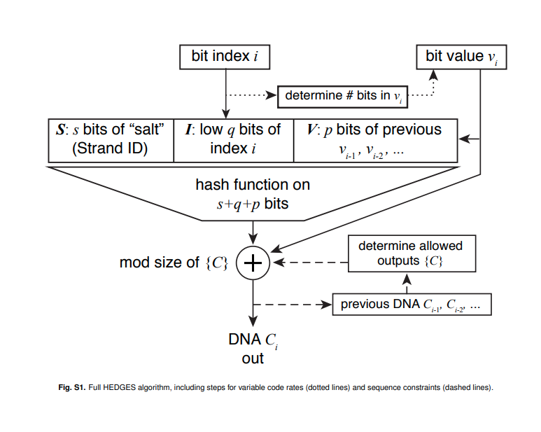

## Primer Generation and Sequence Generation

<!-- toc -->

## Primer Generation

*Contributions*: Lucy, QingRu, Achint, Tina

### Why do we need primers?
Primers are important for DNA synthesis in our bodies. Usually 5-22 nucleotides long, primers are ssDNA that serve to “prime” or prepare a template strand for an enzyme to bind and initiate DNA synthesis. We will be generating primers with the four bases of DNA, because they are easier to synthesize and more stable than RNA based primers. Unlike DNA polymerase, TdT is unique, and does not require a template strand, so we will be focussing on generating primers that TdT can bind to and initiate DNA synthesis. 

Storage-wise, primers act as unique identifiers for the data that is encoded in the information portion of the DNA sequence. Software-wise, the only strict requirement is that it is easy to generate unique primers; however there are biological constraints we must adhere to.

We want to generate primers that confine to these [constraints](https://github.com/UBC-iGEM/dna-software/issues/10), with the goal of ultimately generating acceptable primers for wet lab to order. Given a set of requirements, create primers that the wet lab can use for synthesizing ssDNA with TdT. Additionally, demonstrate that our data storage model will not run out of primers, and that we can create more primers to append/make edits to preexisting files [@Sharma_Lim_Lin_Pote_Jevdjic_2023,].

### How are we generating primers?
Primers will be generated using a “genetic algorithm” [@Wu_Lee_Wu_Shiue_2004]. This requires:
* initial set of k primers
* fitness function

Successors, which are children of the "initial set" of primers, are generated by:
* Selection of two parents by random sampling, as determined by fitness function
* Crossover
* Mutation
These children are then checked against a set of constraints. If these constraints are satisfied, these children primers can be used, otherwise, these children primers become new parents.

This cycle can continue for as many iterations as we want
A fitness function is determined by constraints, each having a weight or “acceptable” range
* primers that fulfill less constraints will have low fitness or be outright rejected

Some constraints include: 
* determining melting temperature [@addgene2019] 
* determining if secondary structures will form, simple reverse string check is performed, but more advanced checks will be tried in futher iterations [@primerpcr].

### How do we test this?
We can use open source tools that evaluate the melting/annealing temperature, secondary structure formation and other constraints to ensure our code is generating acceptable primers. We can also verify by their use in wet lab, however this may not be feasible given lack of time and resources.

## Sequence Generation

*Contributions*: Lucy, Riya, Sebastian

### How do computers interpret bits?
Given a user’s file, we must convert that file, which contains many bits, to a collection of approximately sized nucleotide sequences for synthesis by wet lab. First off, what is are bits? 

A bit, either 0 or 1, is the most basic form of information a classical computer can interpret, meaning data that is stored and interpreted on a computer is in the form of 0 and 1.

A set of bits can have any meaning if there is no context provided behind how to decode these bits. We can interpret bits as a number, or a character.

- if we interpreted these bits using UFT-8: 00100100 -> $
- if we interpreted these bits as a number: 00100100 -> 36

The mapping from binary sequences to characters is standardized via the UTF-8 (Unicode Transformation Format - 8 bits) standard [@wikipediautf]. 

UTF-8 is a standardized format for storing and reading characters. UTF-8 encodes for characters, symbols, etc. There are other standards, such as ASCII, which are cover less characters than UTF-8. For instance, 
- 11100000 10100100 10111001
  - using UTF-8: ह
  - using ASCII: ह
    

When we encode information, it is important to note down, either on the actual DNA strand itself or on a computer, how to interpret these bits once we read back the DNA strand. This is what is called metadata, data that tells you information about data! 

### How are bits converted to nucleotides? 

There are several ways to change a bit sequence into a DNA strand, and a few are listed below: 
- base4 encoding: 0 -> A, 1 -> T, 2 -> G, 3 -> C
- Church encoding: 0 -> A or C, 1 -> G or T
- base2 encoding: 00 -> A, 11 -> T, 01 -> G, 10 -> C
- **HEDGES encoding**
- **Rotation based cipher**

We will be implementing the HEDGES encoding and rotation based cipher.

### What is the rotation based cipher? 

 [@Bornholt_Lopez_Carmean_Ceze_Seelig_Strauss_2016]

Because TdT only adds semi-specifically, meaning it adds bases until it runs out of bases, we can select which base TdT should synthesize, but not how many (there are ways to get around this, but they take more time to implement). Thus, using a rotation based cipher, we can get around this peculiar behaviour of TdT.

The transitions in bases encode for 0, 1 and 2. This cipher encodes for information in base3, whereas computers usually interpret information in base2. We can get around this by converting base2 information to base3. Then, we must select an arbitrary start base, and then follow the arrows to encode information.

### What is the HEDGES encoding?
HEDGES is a type of encoding similar to fountain codes, which tries to encode redundancy using a hash function [@press_2020_hedges]. HEDGES is a type of key-autokey cipher, which means it incorporates portions of the message (our bit sequence) into the encoded nucleotide sequence. Again, what does this mean? 

This means for a bit in position *i* that we want to encode as a nucleotide, we must use the bit sequence up to the position *i* we want to encode to generate the next nucleotide. The most important thing to understand that a hash function, which takes as input a stream of bits, is used to create the nucleotide sequence.

## What is an high level overview of sequence generation?
1. File format
   - the file format tells us how to interpret bits that encode that file
   - without knowing the file format (the file extension), we have no idea what the bits encode for
2. Compression 
   - if there is no special compression strategy, we will just compress using a generic compression algorithm, otherwise, we can take advantage of certain file formats and compress in a special way
3. Block the bit sequence
   - we break the information into chunks of around 80 - 100 nts long
   - if we are doing semi-specific synthesis, probably around 20 - 30 nts long
4. Implementing encoding strategy (convert bit sequence to nucleotide sequence)
   - if we are doing specific synthesis, we will encode the binary information according to HEDGES
   - if we are dong semi-specific synthesis, we must use the rotation based cipher
5. Add outer codes
   - a form of purely redundant error correction, only possible if we are doing specific synthesis
6. Collect metadata
7. Give sequences to wet lab

### How do we test this?
The robustness of our redundancy, collection of metadata will be evaluated
1. In silico: with software generated faulty DNA sequences 
2. In lab: but probably not enough times to be statistically significant

---
