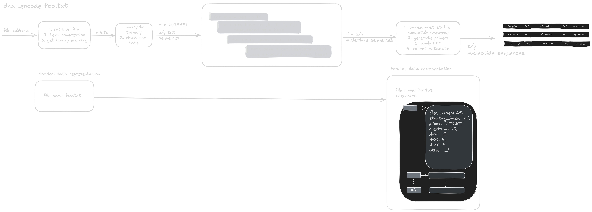

## Encoding

<div class="scroll">



</div>

Consists of segmenting information into blocks, generating primers, mapping primers back to address space and generating all the sequences to be encoded in wet lab.

## Key points

1. Segmentation of data: by breaking an input into smaller blocks, we can control how large or how small a strand is to be synthesized. Shorter strands appear to have a smaller rate of error[^aachen].
2. Redundancy: a message is encoded and transmitted using more bits that are necessary to encode the message; a piece of information is redundant if it can be removed without loss of information [^redundancy]. This has either not been explored in depth by other iGEM teams[^github].
3. Primer generation and and storing primers.
4. Generating sequences to be encoded.

### challenges

- we must adapt ECCs to shorter sequences and semi-specific synthesis

## Segmentation of data

## Redundancy

This something not done in depth by iGEM teams. Redundancy in information theory is when a message is encoded and transmitted using more bits that are necessary to encode the message; a piece of information is redundant if it can be removed without loss of information[^redundancy]. Redundancy can either check for errors, or attempt to correct for errors.

### Information Theory ECCs:

1. Repetition of sequences

   - pros:
     - simple, easy
   - cons:
     - more synthesis and sequencing required
     - multiple reads, when decoding have to do alot of fuzzy string matching

2. Hamming Codes

   - https://en.wikipedia.org/wiki/Hamming_code
   - https://www.cs.utexas.edu/users/misra/Classes.dir/ClassNotes.dir/xor.pdf

3. Reed Solomon Codes

4. Fountain Codes

5. Checksums
   - has been done by another iGEM team[^edinburgh]
   - tells us if an error has occurred, but can't correct for it
   - given rotation based cipher, we could generate probability of likehood between two bases

### DNA Specific ECCs

- Rectangular correction codes[^edinburgh]
- Someone's PhD[^phd]
- Binary Golay code[^golay]:in ternary (like ours)

### Approach:

## Primer generation and storing primers

### Generate Primers:

Primers will be generated through an genetic algorithm, and checked with various open source primer design tools[^genetic] [^uoft] [^tools] [^benchling].

Constraint design:

1. Distance constraints[^block]
   - Run edit distance and Levenshtein distance constraints on all primers after each generation of children primers
2. Biological constraints[^primer]
   - Length: 18 - 30 bases
   - 40 - 60% GC content
   - GC clamp at 3’ end of primer, stronger more specific binding

- Annealing and melting temperature[^primer]
  - T_m - 5 = T_a
  - Forward and reverse should have same/similar temps
  - Calculate melting temperature: 4 for every G/C, 2 for every A/T
  - Secondary structures
  - Use established tools to avoid hairpins, self-dimers, cross-dimers
  - Avoid mispriming
  - Avoid repeats on the 3’ end

## Generating sequences to be encoded

### Rotation Based Cipher[^archival]

```python
huffman_codes = {
    "A": {
        "0": "C",
        "1": "G",
        "2": "T"
    },
    "C": {
        "0": "G",
        "1": "T",
        "2": "A"
    },
    "G": {
        "0": "T",
        "1": "A",
        "2": "C"
    },
    "T": {
        "0": "A",
        "1": "C",
        "2": "G"
    },
}

text = "igem"
binary = binarize(text)
ternary = "10020201220122"

def encode(start: str, ternary: str) -> str:
  output = start

  for trit in ternary:
    current = output[-1]
    next = huffman_codes[current][trit]
    output += next

  return output

print([encode(start, ternary) for start in ["A", "T", "G", "C"]])

```

### Storing primers

On a computer, a tree like data structure will be maintained that maps primers to files. Theoretically, only the primers and some metadata is to be stored on the computer, and all the information is stored on the DNA molecules. We will have to quantify our information density.

---

[^genetic]: Wu, J. S., Lee, C., Wu, C. C., & Shiue, Y. L. (2004). Primer design using genetic algorithm. Bioinformatics (Oxford, England), 20(11), 1710–1717. https://doi.org/10.1093/bioinformatics/bth147
[^aachen]: Aachen 2021. (2021). Team:aachen/results. https://2021.igem.org/Team:Aachen/Results#CyclicSynthesis
[^redundancy]: Redundancy. (2020, March 21). Wikipedia. Retrieved 21:56, February 15, 2024 from https://simple.wikipedia.org/w/index.php?title=Redundancy&oldid=6874959.
[^github]: https://github.com/igemsoftware2021/Aachen_dna-utils
[^archival]: James Bornholt, Randolph Lopez, Douglas M. Carmean, Luis Ceze, Georg Seelig, and Karin Strauss. 2016. A DNA-Based Archival Storage System. SIGPLAN Not. 51, 4 (April 2016), 637–649. https://doi.org/10.1145/2954679.2872397
[^edinburgh]: [https://2016.igem.org/Team:Edinburgh_UG/Error_Correction](https://2016.igem.org/Team:Edinburgh_UG/Error_Correction)
[^golay]: [https://arxiv.org/abs/1501.07133encodes](https://arxiv.org/abs/1501.07133encodes)
[^phd]: [https://thesis.library.caltech.edu/14951/1/Caltech_Thesis_Jin%20Sima.pdf](https://thesis.library.caltech.edu/14951/1/Caltech_Thesis_Jin%20Sima.pdf)
[^block]: Puru Sharma, Cheng-Kai Lim, Dehui Lin, Yash Pote, and Djordje Jevdjic. 2023. Efficiently Enabling Block Semantics and Data Updates in DNA Storage. In Proceedings of the 56th Annual IEEE/ACM International Symposium on Microarchitecture (MICRO '23). Association for Computing Machinery, New York, NY, USA, 555–568. https://doi.org/10.1145/3613424.3614308
[^uoft]: [https://tspace.library.utoronto.ca/retrieve/2354/jb03019.pdf](https://tspace.library.utoronto.ca/retrieve/2354/jb03019.pdf)
[^primer]: [https://www.addgene.org/protocols/primer-design/](https://www.addgene.org/protocols/primer-design/)
[^tools]: [https://blog.addgene.org/free-online-molecular-biology-tools](https://blog.addgene.org/free-online-molecular-biology-tools)
[^benchling]: [https://www.benchling.com/in-silco-primer-design-tools#chapter5](https://www.benchling.com/in-silco-primer-design-tools#chapter5)
