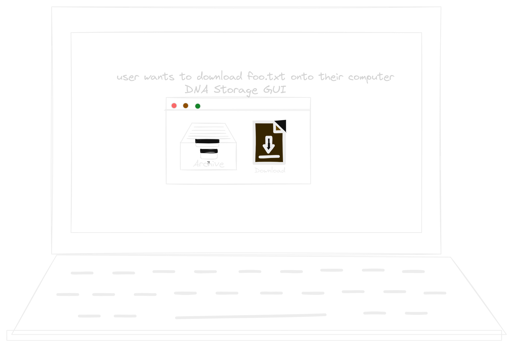

# Software

<!-- toc -->

[💻 Our Repository](https://github.com/UBC-iGEM/dna-software)

*Contributions*

Lucy, Riya, Sebastian, Samuel

## Overview
This document is related to the software component of the DNA storage process. This entails turning a binary sequence into a sequence of biological bases for information storage.

## Context and scope
Some terminology that will be mentioned across the software pages include:
- frontend: portion of software that a user directly interacts with, another word for GUI
- GUI: graphical user interface
- backend: portion of software that the user does not see and interact with directly. Comprises of the encoding, decoding and error correction algorithms.

In the context of a user who wants to store long-term information, they use the graphical user interface to select a file to be stored in DNA. After making the request to store a file, the software, sends DNA sequences to be synthesized to the [Microfluidics](../hardware/microfluidics/index.md) platform, which synthesizes the required DNA sequences. After the [Microfluidics](../hardware/microfluidics/index.md) platform synthesizes the DNA molecules, it sends a signal back to the software to complete the storage process, showing the user that information their information has been successfully synthesized and stored in DNA.

When the user wants to retrieve information that they previously stored in DNA, the user selects the file they want to retrieve. The software sends the primers associated with that file to the [Microfluidics](../hardware/microfluidics/index.md) platform, which runs PCR on chip, and sequencing of the DNA strands occurs. After sequencing is done, the sequences are returned to software to reconstruct into one file. Ideally, this entire process is autonomous.

In reality, with the limited time and resources our team has, we will not get this workflow to work autonomously from dry lab to wet lab. 

For purposes of the E-DBTL cycle, some details will be exposed to the user, such as: 
- the sequences to be synthesized, along with the corresponding primer
  - This detail should be hidden from the user in a real world use case
- selection of different encoding/decoding/ECC algorithms to use on input data

## DBTL Cycles
### Iteration 1
Implement a barebones pipeline, and see how much error can be tolerated in 100 nucleotide long DNA sequences with in silico testing.

#### Backend
Goal: [Encoding](encoding.md) (given an existing file, convert that file into sequence(s) of nucleotides): 
1. Primer generation
2. Sequence generation
3. Collect metadata for error correction and for putting the sequences back into a file

Goal: [Decoding](decoding.md) (given a request for a certain file): 
1. Return the primers to wet lab needed to retrieve the DNA molecules containing that file
2. After returning the sequences, perform sequence recovery
3. Apply error correction based on collected metadata
4. Collapse sequences back into one file
5. Return the file to the user

#### Frontend
Goal: A user should be able to drag a file into the application, create new folders, rename folders, delete folders, delete files.
- should be cross platform
- for iHP interviews should have GUI ready early

#### Testing
Goal: [ChaosDNA](chaosdna.md) (provide platform for in-silico testing of software):
1. Given a string, total error rate, deletion error rate, mutation error rate, insertion error rate, generate a distribution of sequences that may be synthesized from wet lab
2. Run our software on these faulty sequences
3. Run statistical analysis on the success rate of software

If we are satisfied with our initial MVP platform, we can demonstrate encoding/decoding of large files, and persistence.

### Iteration 2
Redefine algorithms to tolerate up to 30% error in 100 nucleotide long DNA sequences, with in silico testing.

### Iteration 3 
Implement DNA Storage Alliance specifications, and do in silico testing on DNA sequences with 1000s of nucleotides.
- [Sector Zero](https://www.snia.org/standards/technology-standards-software/standards-portfolio/dna-data-storage-sector-zero)
- [Sector One](https://www.snia.org/standards/technology-standards-software/standards-portfolio/dna-data-storage-sector-one)

### Iteration 4/5 
Test our software on sequences synthesized by wet lab, and redefine algorithms with in silico testing and wet lab data.

## Diagrams
**User POV: Encoding**

**Wet-Dry Lab**

**User POV: Decoding**

**Wet-Dry Lab**

## Existing solutions
- [Python implementation of DNA storage system](https://github.com/dna-storage/dnastorage)
- [DNA storage for nanopore sequencing using convolutional coding and basecaller-decoder integration](https://github.com/shubhamchandak94/nanopore_dna_storage)

## How do we test this?
The most important portion of our backend to test is the error correction. To complete iterations of the E-DBTL cycle, testing in silico will occur. Inspired by [chaos engineering](https://en.wikipedia.org/wiki/Chaos_engineering), we will create [ChaosDNA](chaosdna.md), an algorithm that simulates faults (deletions, insertions, mutations) in DNA sequences. Using [ChaosDNA](chaosdna.md), we can alter the rate of total error, then alter the proportions of deletion, insertions, mutations. We then run the error correction mechanism can against the faulty strands.

When wet lab has finished their POC, we can give wet lab different sequences of varying levels of redundancy to see the effect of adding more error correction and try to identify the most common type of error that occurs.

For primer generation, we can use open source tools online to test our primers, and later verification from the wet lab.
 
To test the graphical user interface, we will conduct interviews with the general public to see how they would use our tool.

