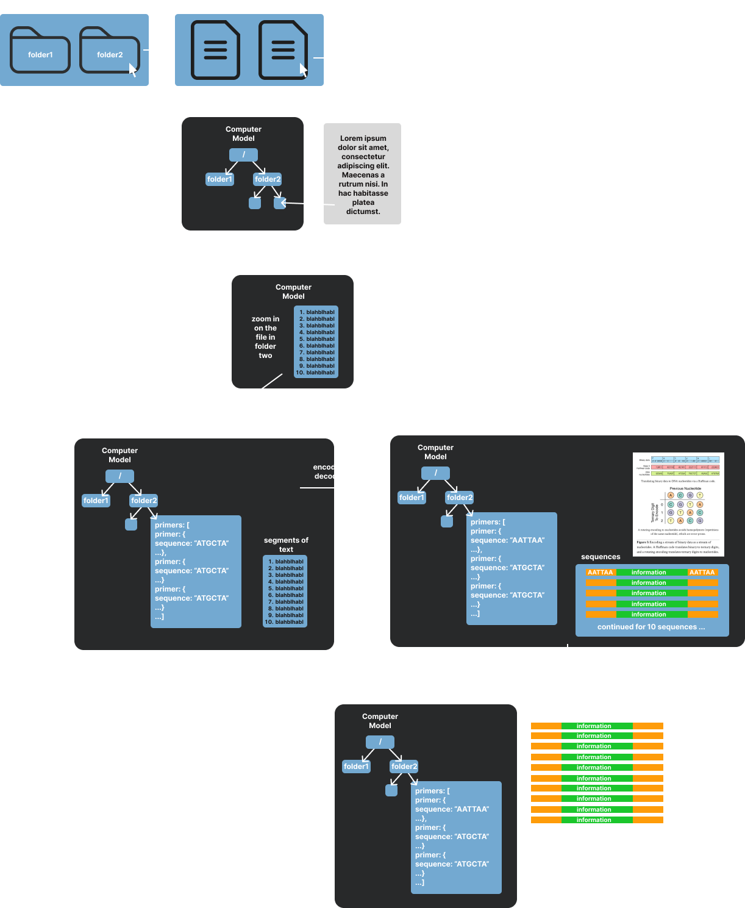

# Software

## GitHub Repos

## Resources
- https://docs.rs/acid-store/latest/acid_store/
- https://github.com/dna-storage/dnastorage
- https://github.com/shubhamchandak94/nanopore_dna_storage
- https://github.com/HaolingZHANG

## Components

### Graphical User Interface

### Encoding
- Redundancy
- Mapping of primers back to address space in software
- Primer generation
- Rotation based cipher
- Segmentation (blocks) of information

### Decoding
- Error correction
- Image processing
- Fuzzy string matching of primers with variable lengths of DNA sequences
- Reconstructing the file in software

### DNA as a Persistent Data Structure
- Generation of primers
- Reconstructing the file with updates in software
