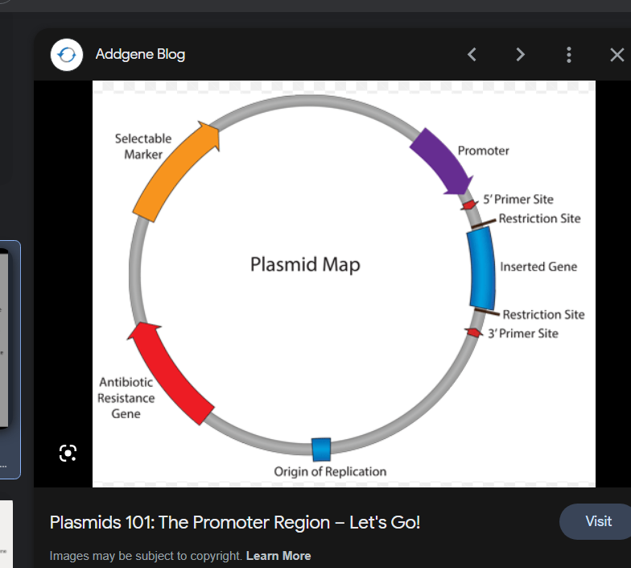

# General Resources

<!-- toc -->

## Introduction to Synthetic Biology
Thanks to Piyush and Kimia for these resources!

Synthetic biology is a field of biology that combines principles of engineering and science to create new biological systems or modify existing ones for specific purposes. This can include the engineering of new enzymes, the creation of living organisms with specific properties or the development of new genetic circuits. The ultimate goal of synthetic biology is to create new functions or applications that are not found in nature.

To begin, familiarize yourself with general biology. In the suggested videos below, I will be focusing on the central dogma of biology (how do we get from DNA to protein), but I **highly recommend** you look into additional resources if you need help!

### CrashCourse: DNA Structure and Replication

<iframe width="560" height="315" src="https://www.youtube.com/embed/8kK2zwjRV0M?si=Qka0_Mb54TLiqgW9" title="YouTube video player" frameborder="0" allow="accelerometer; autoplay; clipboard-write; encrypted-media; gyroscope; picture-in-picture; web-share" allowfullscreen></iframe>

### CrashCourse: Transcription and Translation

<iframe width="560" height="315" src="https://www.youtube.com/embed/itsb2SqR-R0?si=KvhQTRVd8KucgzyG" title="YouTube video player" frameborder="0" allow="accelerometer; autoplay; clipboard-write; encrypted-media; gyroscope; picture-in-picture; web-share" allowfullscreen></iframe>

### CrashCourse: What is Biotechnology?

<iframe width="560" height="315" src="https://www.youtube.com/embed/Qo9gcZ0r8k8?si=nMA58Wy8U3XXxUa8" title="YouTube video player" frameborder="0" allow="accelerometer; autoplay; clipboard-write; encrypted-media; gyroscope; picture-in-picture; web-share" allowfullscreen></iframe>

## CSBERG (Canadian Synthetic Biology Education Research Group):

- [YouTube videos](https://www.youtube.com/playlist?list=PLzvN52ZEpjycAiYGH8gwvmNcba9ckz_US)
- [Google Drive folder](https://drive.google.com/drive/folders/1t2Sdaso1IImNbQC8IbyVLTqBLy8Ftrtb?usp=sharing)

## iGEM engineering webinars (thanks to Kimia for these resources)

- [https://technology.igem.org/engineering/webinars](https://technology.igem.org/engineering/webinars)
- [https://2021.igem.org/Engineering/Webinars](https://2021.igem.org/Engineering/Webinars)
- [Examples of Successful Past iGEM Dry-Lab Projects](https://2020.igem.org/Teams/Mentorship/Dry_Lab_Impulse)

## Bioinformatics
(thanks to Chae for these resources)

- [Analyzing RNA-seq data with DESeq2](https://bioconductor.org/packages/devel/bioc/vignettes/DESeq2/inst/doc/DESeq2.html)
- [RNA-seq workflow: gene-level exploratory analysis and differential expression](https://bioconductor.org/packages/release/workflows/vignettes/rnaseqGene/inst/doc/rnaseqGene.html)

## Chemical Engineering Modelling

- [OpenChemE modelling GitHub](https://github.com/OpenChemE)

## Math Modelling

- [Mathematical modeling in systems biology](https://www.math.uwaterloo.ca/~bingalls/MMSB/Notes.pdf)

## Enzyme Kinetics

(Thanks to Piyush for these resources)

In this section, you will be learning about Enzymes, and how they may be modelled mathematically. This is similar to the Le Chatelier’s principle from **IB Chemistry 12**, so may be a good idea to brush up on that if you are a little rusty!

### OrganicChemTutor: What is an Enzyme?

<iframe width="560" height="315" src="https://www.youtube.com/embed/tCGUsiXIYhw?si=P68jJpaMaZKsylAQ" title="YouTube video player" frameborder="0" allow="accelerometer; autoplay; clipboard-write; encrypted-media; gyroscope; picture-in-picture; web-share" allowfullscreen></iframe>

### KhanAcademy: Introduction to Enzyme Kinetics

<iframe width="560" height="315" src="https://www.youtube.com/embed/X_YXTWU2maY?si=tKspCTakdMpq4kaV" title="YouTube video player" frameborder="0" allow="accelerometer; autoplay; clipboard-write; encrypted-media; gyroscope; picture-in-picture; web-share" allowfullscreen></iframe>

### KhanAcademy: Steady States and Michaelis-Menten Equations

<iframe width="560" height="315" src="https://www.youtube.com/embed/7u2MkbsE_dw?si=EbxaE-_RQQV75woU" title="YouTube video player" frameborder="0" allow="accelerometer; autoplay; clipboard-write; encrypted-media; gyroscope; picture-in-picture; web-share" allowfullscreen></iframe>

### KhanAcademy: Enzymatic Inhibition

<iframe width="560" height="315" src="https://www.youtube.com/embed/ALU24yhKJZw?si=ncx0lXGDp2TEbC3n" title="YouTube video player" frameborder="0" allow="accelerometer; autoplay; clipboard-write; encrypted-media; gyroscope; picture-in-picture; web-share" allowfullscreen></iframe>

### KhanAcademy: Cooperativity

<iframe width="560" height="315" src="https://www.youtube.com/embed/5xp9lI_fXDo?si=Xakc1uBTg53tbJtg" title="YouTube video player" frameborder="0" allow="accelerometer; autoplay; clipboard-write; encrypted-media; gyroscope; picture-in-picture; web-share" allowfullscreen></iframe>

### KhanAcademy: Allosteric Regulation and Feedback Loops

<iframe width="560" height="315" src="https://www.youtube.com/embed/UWrJssS76XE?si=l4aa-sDBzaye_wwn" title="YouTube video player" frameborder="0" allow="accelerometer; autoplay; clipboard-write; encrypted-media; gyroscope; picture-in-picture; web-share" allowfullscreen></iframe>

### KhanAcademy: Non-Enzymatic Protein Function

<iframe width="560" height="315" src="https://www.youtube.com/embed/eVmLvbB6L18?si=nY1tfSBOONdYhm1K" title="YouTube video player" frameborder="0" allow="accelerometer; autoplay; clipboard-write; encrypted-media; gyroscope; picture-in-picture; web-share" allowfullscreen></iframe>

### KhanAcademy: Covalent Modifications to Enzymes

<iframe width="560" height="315" src="https://www.youtube.com/embed/yqwnRekNLg4?si=0mR1APFVir6rybZO" title="YouTube video player" frameborder="0" allow="accelerometer; autoplay; clipboard-write; encrypted-media; gyroscope; picture-in-picture; web-share" allowfullscreen></iframe>

## Protein Modelling

- [Solvation free energy of ethanol](https://tutorials.gromacs.org/docs/free-energy-of-solvation.html)
- [Gromacs Tutorials](http://www.mdtutorials.com/gmx/)
- [Pyrosetta Tutorials](https://www.pyrosetta.org/documentation/tutorials)
- [Introduction to QM/MM Simulations](https://www.mpinat.mpg.de/634655/Groenhof_2013_Meth_Mol_Biol.pdf)
- [Quantum Mechanics/ Molecular Mechanics (QM/MM)](https://dasher.wustl.edu/chem478/lectures/lecture-26.pdf)
- [Hybrid Quantum-Classical simulations (QM/MM) with CP2K interface](https://www.gromacs.org/topic/qmmm.html)
- [Machine Learning in QM/MM Molecular Dynamics Simulations of Condensed-Phase Systems](https://pubs.acs.org/doi/10.1021/acs.jctc.0c01112)
- [MiMiC Hybrid Quantum Mechanical/Molecular Mechanical simulations](https://manual.gromacs.org/current/reference-manual/special/mimic-qmmm.html)
- [Mixed Quantum-Classical simulation techniques](https://manual.gromacs.org/2021.2/reference-manual/special/qmmm.html)
- [A user-friendly, Python-based quantum mechanics/Gromacs interface: gmx2qmmm](https://onlinelibrary.wiley.com/doi/abs/10.1002/qua.26486)
- [Practical: Introduction to quantum mechanics / molecular mechanics (QM/MM) simulations](http://cmb.bio.uni-goettingen.de/pract/p7/)
- [Introduction to QM/MM](https://www.ebi.ac.uk/training/materials/biomolecular-simulations-materials/introduction-to-qm-mm/introduction-to-qm-mm/)
