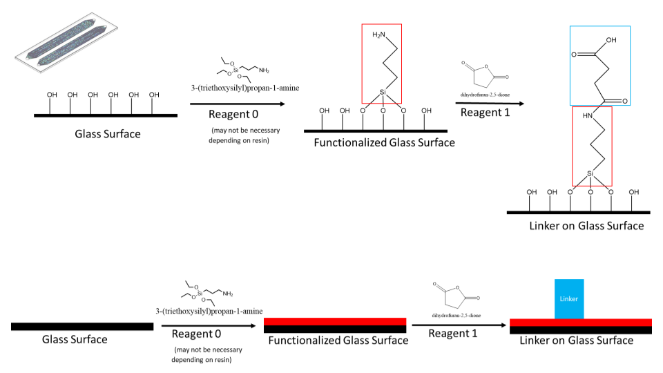
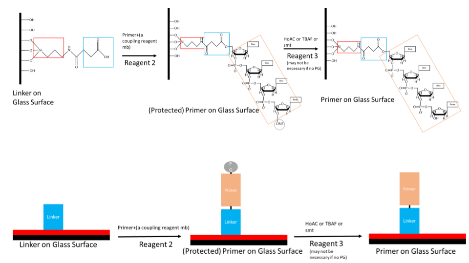
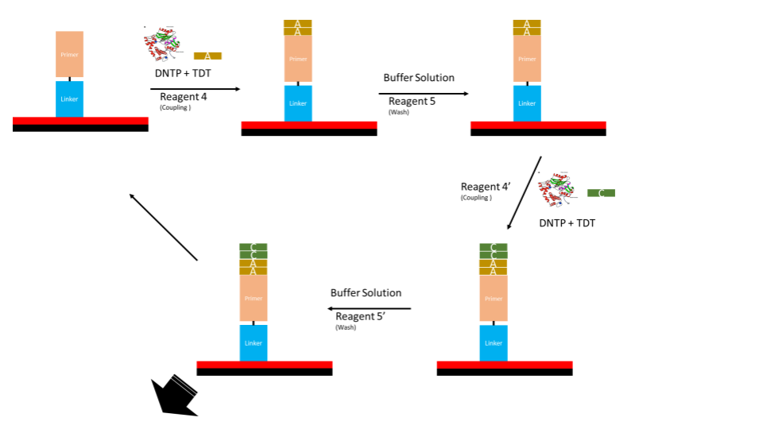
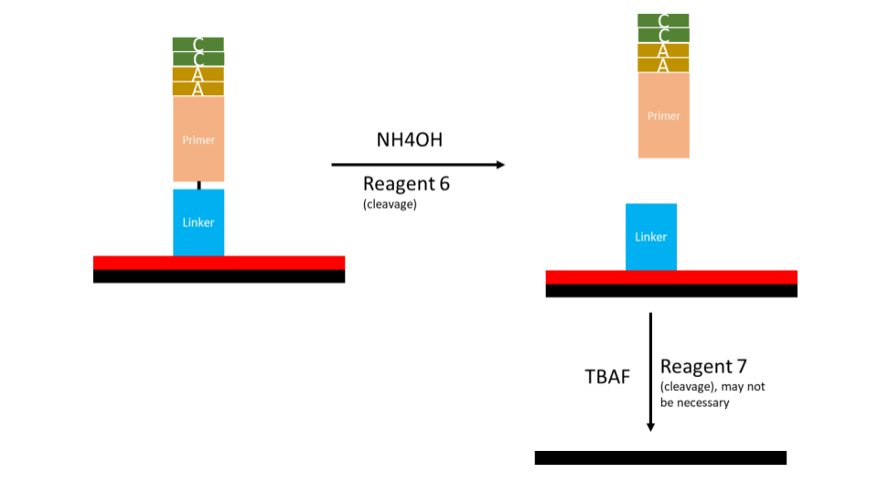

# Project Related Resources

This is where leads and other subteam members can add ([or request to](https://github.com/UBC-iGEM/internal-wiki-2023-24/issues/new?assignees=&labels=&projects=&template=add-a-project-related-resource.md&title=Add+resource%3A+%5Btopic%5D) notes and resources relating specifically to our project.

<!-- toc -->

## Wet Lab
### Solid Phase Synthesis

## Dry Lab

### Moore's Law

### Glacial Storage 
Check out these [dry lab slides](https://docs.google.com/presentation/d/1nQOVYAYPGF8G0qWAzkASHRrQ8TtsM2maiz3NgsDCdHM/edit?usp=sharing) for some info on Glacial Storage!

### Information Theory

#### Why binary?

#### Error Correction

