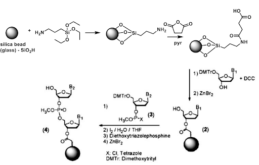
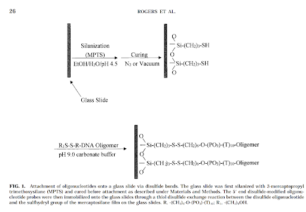
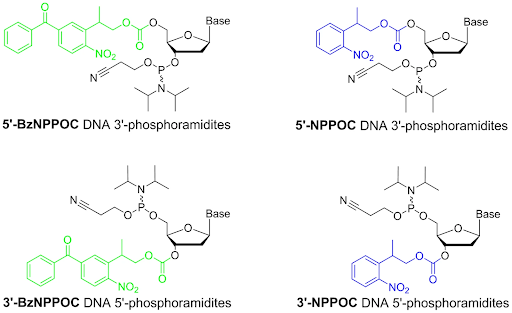
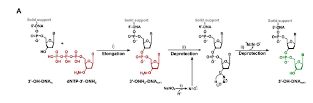
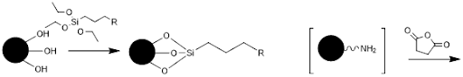

# Solid phase DNA Synthesis

## Solid phase DNA Synthesis

This document outlines the process of non-traditional solid phase DNA synthesis through the use of tdt. In particular, this document will provide a broad overview of the workflow and the details of primer immobilization, solid phase chemistry, and primer cleavage. It also outlines the chemistry of monomers intended to use.
## Context and Scope

Traditional solid phase chemical synthesis occurs from 3’ -> 5’ as shown below.

This is an important consideration as a robust set of chemical reactions exist for the immobilization of nucleic acids on the solid phase. However, there is a comparatively smaller tool box for synthesis in the reverse (5’->3’) direction. Additionally, chemical solid phase synthesis involves protecting groups on the exocyclic nitrogenous bases. For our purposes, we require a method to immobilize the 5’ end on the solid phase, leaving the 3’ end open to react with incoming DNTPs.

For controlled single nucleotide insertion, a robust yet readily cleavable protecting group is required. The primary method of 3’ protection for 5’ to 3’ synthesis is photolabile protecting groups. These groups are efficiently cleaved when exposed to UV light. These groups have been developed due to the desire to generate complex microarrays for genetic analysis. With photolabile protecting groups, a desired pattern of unique oligonucleotides may be synthesized. This chemistry can be leveraged for the use of TDT single nucleotide insertion.

## Goals
The goal of this phase is 
  1. To functionalize the surface for the immobilization of primers
  2. To immobilize the primer 5’ end on the solid phase at a high enough density and selectivity to enable efficient DNA synthesis
  3. To characterize the density of primer immobilization
  4. Lastly, the primer and newly synthesized DNA strand must be cleaved from the solid phase

## The actual design of immobilization

There are two different methods being considered for immobilization. All approaches are based on the same principle. 

Disulfide 5’ modifier and dibenzocylooctyne 5’ modifier are the primer methods in consideration. The idea with each modified primer is to use orthogonal reacting functional groups. As a DNA oligo has both a 3’ and 5’ free hydroxyl group, using a 5’ modifier that selectively reacts with its counterpart would prevent the 3’ hydroxyl from reacting in any meaningful quantities.

Rogers, Y.-H.; Jiang-Baucom, P.; Huang, Z.-J.; Bogdanov, V.; Anderson, S.; Boyce-Jacino, M. T. Immobilization of Oligonucleotides onto a Glass Support via Disulfide Bonds: A Method for Preparation of DNA Microarrays. Analytical Biochemistry 1999, 266 (1), 23–30. DOI:10.1006/abio.1998.2857.

## The actual design of modified DNTPs

The DNTPs will be ordered as 3’-BzNPPOC modified DNTP’s or 3’aminohydroxy modified DNTPs. BzNPPOC is a highly photolabile group that is readily cleaved in UV light. This protecting group has been highly used in chip chemistry however care is required to prevent premature deprotection when exposed to ambient light. 3’aminohydroxyl groups are readily cleaved in sodium nitrite. These modified nucleotides will allow for single insertion as there is no 3’ hydroxyl for additional reaction. Thus a specific synthesis can be achieved. As part of the tdt synthesis workflow, an additional deprotection step is required prior to the following nucleotide reaction.

Hölz, K.; Hoi, J. K.; Schaudy, E.; Somoza, V.; Lietard, J.; Somoza, M. M. High-Efficiency Reverse (5′→3′) Synthesis of Complex DNA Microarrays. Scientific Reports 2018, 8 (1). DOI:10.1038/s41598-018-33311-3. 

Verardo, D.; Adelizzi, B.; Rodriguez-Pinzon, D. A.; Moghaddam, N.; Thomée, E.; Loman, T.; Godron, X.; Horgan, A. Multiplex Enzymatic Synthesis of DNA with Single-Base Resolution. Science Advances 2023, 9 (27). DOI:10.1126/sciadv.adi0263. 

## Proposed solutions to immobilization

Initially, the glass will be functionalized or derivatized. The free hydroxyl groups react with a molecule containing a silyl ether on one end and a functionalized group on the other end. 

In the case of the 5’ disulfide modified primer, R would be a thiol. For the 5’ dibenzocylcooctyne modified primer, R would be an azide. This functionalizes the glass surface for addition of various chemicals. Addition of the 5’ modified primer would then react with the glass surface and covalently immobilize it. 

The immobilization will be tested with fluorescing primers. Primers used for optimization will require both the necessary 5’ modifier as well as a fluorescing group either on the 3’ end or nitrogenous base. Regardless of where the group is located, this will allow us to determine the efficiency of coupling as well as the density of primers.

The stability of the immobilization can also be tested against the flow of various reagents using this method.

Once the reagents are in position, the reactions and characterization should be complete within 2-3 weeks. 
