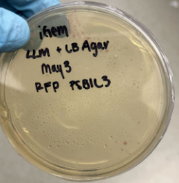
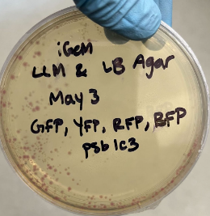

# Notebook

Welcome to the Wet Lab notebook. For each month, create a new file in SUMMARY.md with the naming convention: month.md. For each day you add a journal entry, go to the corresponding month.md file, and at the top of the file, and add an entry, here's an example:

## May 4th, 2022

### People: 
Oliver, Edward, Michaela, Anjali, Amy, Bhavya, Chloe, Shaqed, Stella

### Tasks: 

- Transformation results: 
  - Only RFP colonies grew (Pictured) on the RFP only plate and the plasmid mix plate

- New transformations
  - 2 AmilCP plates chloramphenicol LB agar plate, left in 37C room overnight

- Vibrio natriegens media preparation
  - 297 mls of 300 ml prepared 2x LB + 7.04 g/l NaCl - autoclaved
  - 3 mls of 4ml prepared 420 mM KCL and 2.314 M MgCl2 - filter sterilized
  - 297 + 3 = 300 ml final media 

### Notes: 

If you need to add images, make a folder with the date with in the wet lab folder, and add images into that folder. An example already exists for the entry above. Then go to your file and add the images like this:

`

`
